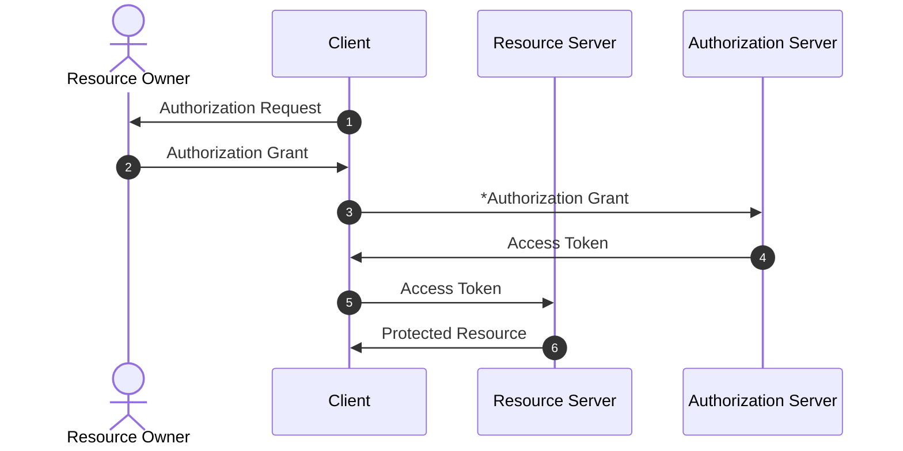
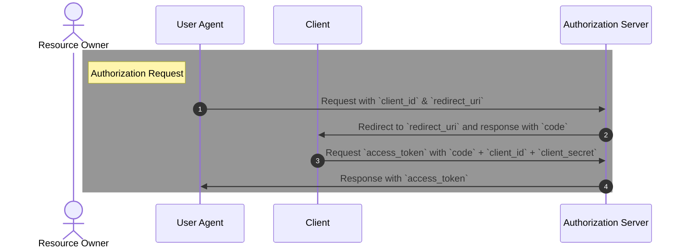

# OAuth 2.0

常用於第三方登入 (Facebook, Line, Google 等)

## Flowchart

情境

有一個小眾網站 A 提供 Github 登入

角色

- Resource Owner: 自己 (資源擁有者)
- Client: A (提供第三方登入的服務)
- Resource Server: Github (存放資料的 Server)
- Authorization Server: Github (專門授權的 Server)

> Resource Server 和 Authorization Server 可以是同個域名，但嚴格來說這兩個角色應該要分開

## OAuth 授權方式 (*Authorization Grant 部分)

Client 需要先到 Resource Server 申請一組 client_id & client_secret (用於加密)

以 Github 為例 https://github.com/settings/developers

(Settings / Developer settings / OAuth Apps)

申請所需資訊包含

- Application name
- Homepage URL
- Authorization callback URL (redirect_uri)

### Authorization Code

流程圖

> User-Agent: web browser 或 mobile app

#### Request Parameter (Client -> Authorization Server)

必填

- response_type: 固定為 code，表示這是一個授權碼請求
- client_id: Resource Server 用於標示 Client 用

選填

- redirect_uri: Authorization Server 認證成功後導向的網址
- scope: Access Token 可請求的資源範圍 (相當於權限)
- **state**: Client 用於識別 Resource Server 用，參數內容會照樣返回給 redirect_uri

#### Response Parameter (Authorization Server -> Client)

- access_token
- token_type: bearer 或 mac
- expires_in: access_token 過期時間，單位為秒
- refresh_token: 用於更新過期的 access_token
- scope: access_token 權限範圍

# Reference

- https://www.youtube.com/watch?v=T0h6A-M_WmI